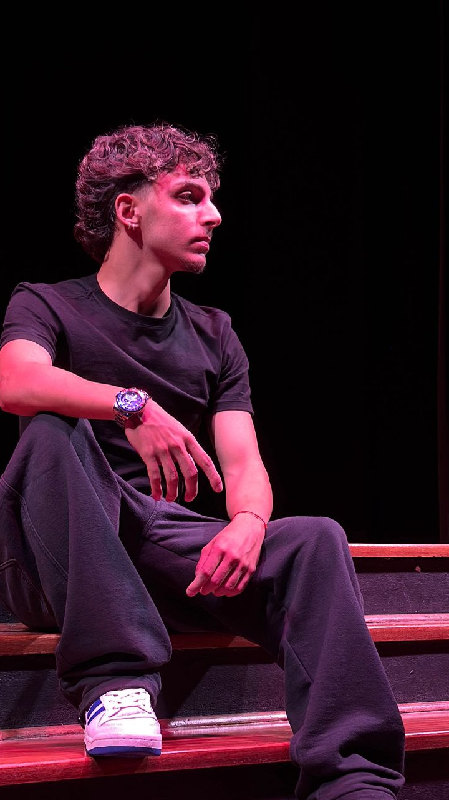

# 🌿 Soul Up: Revolução Sustentável na palma da sua mão.

<p align="center">
  
  
  
</p>

---

## 🌎 Sobre o Projeto

A **Soul Up** não é apenas um aplicativo, é uma revolução no modo como interagimos com o planeta. Nossa plataforma utiliza tecnologia de ponta para validar e recompensar suas atitudes sustentáveis no mundo físico. 

Através de um sistema integrado de IA, transformamos cada quilometro caminhado, cada quilo de material reciclado e cada Watt de energia solar gerada em pontos que se transformam em **economia real**.

---

## ✨ Funcionalidades Principais

| 🌱 Sustentabilidade | 🤖 Tecnologia | 👥 Conexões | 💰 Recompensa |
| :--- | :--- | :--- | :--- |
| Nossa essência é transformar a consciência ambiental em hábito. Criamos um ecossistema focado no impacto real, onde a tecnologia impulsiona atitudes que preservam o planeta e constroem um futuro mais verde.  | Para deixar nosso sistema mais seguro, nossa inteligência artificial é o motor que valida a mudança no mundo real. Através do reconhecimento de imagens, ela comprova as ações ecológicas dos usuários com precisão, transformando atitudes sustentáveis em Pontos ECOA de forma confiável e automatizada. | Somos uma rede social que une pessoas e comunidades pelo mesmo propósito. Fortalecemos o engajamento através de desafios saudáveis, cooperação e o compartilhamento de conquistas ecológicas. | Fazemos o bem ao planeta gerar valor no bolso. Transformamos os esforços ecológicos dos usuários em benefícios tangíveis no mundo real, como descontos na conta de luz e vantagens em marcas parceiras. |

---

## 🛠️ Ferramentas e Tecnologias

O desenvolvimento deste projeto foi realizado utilizando as seguintes ferramentas/tecnologias:

* **Editor de Código:** Visual Studio Code 
* **Controlo de Versão:** Git & GitHub  
* **Hospedagem:** Vercel 
* **Front-end:** HTML, CSS e JavaScript   
  
  
---

## 📁 Estrutura de Pastas do Projeto

```text
📁 projeto-soulup
┃ ┣ 📂 css
┃ ┣ 📂 imagens
┃ ┣ 📂 js
┃ ┣ 📂 paginas
┣ 📂 paginas
┣ 📄 index.html
┗ 📄 README.md
````
---

## 👥 Autores e Créditos

| Foto | Nome | RM | Turma | GitHub | LinkedIn |
| :---: | :--- | :---: | :---: | :---: | :---: |
|  | **Ana Clara Pereira de Magalhães** | 560871 | 1TDSPF | [](https://github.com/anapmagalhaess) | [](https://www.linkedin.com/in/anaclmagalhaes/) |
|  | **Luis Felipe Fernandes Esteves** | 569064 | 1TDSPF | [](https://github.com/luisfelipe-fernandesesteves) | [](https://www.linkedin.com/in/luis-felipe-f-b2a3983b3/) |
|  | **Larissa Koprowski Ferreira** | 572983 | 1TDSPF | [](https://github.com/lkoprowskif) | [](https://www.linkedin.com/in/larissa-koprowski-111b3a357/) |
|  | **Pedro Henrique De Lima Reis** | 569178 | 1TDSPF | [](https://github.com/pedrolimeisdev) | [](https://www.linkedin.com/in/pedrolimeis/) |
|  | **Enzo Torres Estanguera** | 568937 | 1TDSPF | [](https://github.com/enzoestanguera) | [](https://www.linkedin.com/in/enzo-estanguera/) |
---

## 🔗 Links do Projeto

* **Repositório:** [https://github.com/anapmagalhaess/projeto-soulup](https://github.com/anapmagalhaess/projeto-soulup)
* **Deploy:** [https://projeto-soulup.vercel.app/](https://projeto-soulup.vercel.app/)

---

## 🖥️ Nosso Projeto 

### * **Página Inicial**

### * **Sobre**

### * **FAQ**

### * **Desafios**

### * **Soluções**

### * **Contato**

### * **Quem Somos**

---

## ⚔️ Desafios 
<p>Ao longo da construção desse projeto, diferentes desafios surgiram, exigindo pesquisa, experimentação e adaptação constante. Esses obstáculos constribuiram diretamente para o aprimoramento técnico e de consolidação de boas práticas de desenvolvimento desse projeto.</p>
---

## 🏆Soluções
<p>As soluçoes desse projeto foram projetadas para garantir eficiência, organização e escalabilidade, atendendo os requisitos propostos de forma estruturada e sustentavel.</p>

## 📞 Contato e Suporte

<p> Para dúvidas, sugestões ou suporte técnico, o contato pode ser realizado através de qualquer um dos perfis do LinkedIn listados acima ou abrir uma <bold>Issue</bold> no repositório oficial do projeto.<br>
  
<br>✉️ E-mail: nextgen.solucoestech@gmail.com
<br>❓ Abra uma Issue aqui: https://github.com/anapmagalhaess/projeto-soulup/issues
</p>

##

<p align="center">
  Desenvolvido com foco em um futuro mais verde 🌿
</p>
